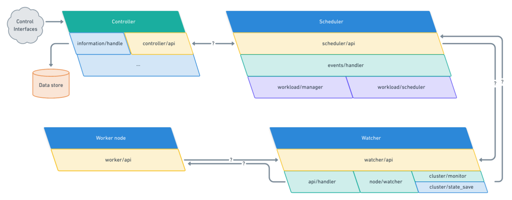

# Scheduler

## Main goal

The `scheduler` goal is to determine whether or not a workload can work on the cluster.
In the case a workload fits to a node, we send severals orders & informations to the node so
he can handle the needed workload. The controller can also determine in a first time, if a workload can be managed in the cluster, but
the scheduler has the **last word** on it. 

This service **must** be able at anytime, to request a delete or an update of a workload on a specific
node. These requests will be sent based on event the scheduler receive. The events are coming either from the controller or from a node.

The `scheduler` is a central point to the whole cluster communication. The service is able to filter
data coming from nodes and lift them up to the controller. By being a central point of communication
the `scheduler` can be considered as a [SPOF](https://en.wikipedia.org/wiki/Single_point_of_failure), 
considering that, this service must be able to recover from a crash **quickly** and **dynamically**.

**Features summary**:

* Allocate a workload to a node
* Request workload update 
* Request workload deletion
* Handle statistics & hardware informations from nodes
* Lift up informations from nodes to controller 
* Handle various events from nodes 

## Architecture overview

The `scheduler` domain is composed of two main services, which are composed of multiple components.

**Scheduler**

*The scheduler handles the whole logic of the scheduler by receiving events from the scheduler API. This API communicate
with either the controller and the watcher.*

Components:

* `scheduler/api`: API which receive and send requests to needed services
* `events/handler`: Depending on the type of API calls received, the event handler will redirect
the information to the proper sub-component.
* `workload/manager`: Process an event related to a workload getting down, to be destroyed or needs to be moved
* `workload/scheduler`: Process controller events needing to schedule a new workload on the cluster
* `cluster/monitor`: Handle API calls relative to statistics and nodes monitoring
* `cluster/state_save`: Save the current state of the cluster 

**Watcher**

*The watcher is here to handle requests coming either from scheduler and nodes. It watch after nodes
in order to create events so the scheduler is warned as soon as a node is down.*

Components:

* `watcher/api`: API which receive and send requests to needed services
* `api/handler`: Handle API calls and redirect them properly
* `node/watcher`: Running continuous watch process to know when a node is down

## Communication protocol

Here we must define the communication protocol used on the cluster.

## Watcher 

### Events 

Every events handled by the watcher, they are all either coming from node or `scheduler`.

### Recovery in case of crash

As written above, `scheduler` is a SPOF, this part is about how we can manage a recovery. 

## Controller

This part must explain everything needed from a controller, why & a solution to implement it.

* What are the informations, events the controller needs to know about the cluster ?

## Node 

This part must explain everything needed from a node, why & a solution to implement it.

* What is the sending frequency of informations ? Does it need to be dynamic, if so we need the controller to know that 
as he will manage this state. 