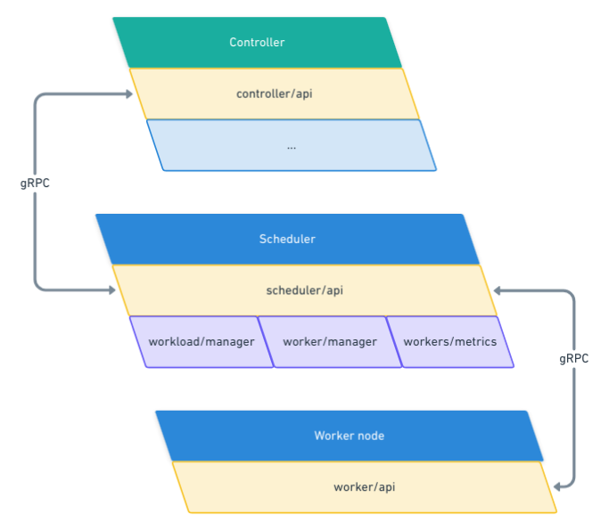

# Scheduler

## Main goal

The `scheduler` goal is to find the appropriate location for a workload's instance to be ran.
In the case an instance fits to a node, `scheduler` orders the worker node to run it. The controller determines
if the requested resources from the workload can be managed in the cluster, and then the scheduler receives the `scheduling request`.

This service **must** be able at anytime, to request a delete or an update of a workload on a specific
node. These requests will be sent based on event the scheduler receive. The events are coming either from the controller or from a node.

The `scheduler` is a central point to the whole cluster communication. The service is able to filter
data coming from nodes and lift them up to the controller. By being a central point of communication
the `scheduler` can be considered as a [SPOF](https://en.wikipedia.org/wiki/Single_point_of_failure), 
considering that, this service must be able to recover from a crash **quickly** and **dynamically**.

**Features summary**:

* Select an appropriate worker node for workload instance to run on.
* Request workload update 
* Request workload deletion
* Handle statistics & hardware informations from nodes
* Forward informations from nodes to controller 

**Glossary:**
* Node: A server of the cluster
* Node server: The master node which contain cluster essentials components
* Node worker: A slave node wich receive instruction from master node
* Worker: entity managing workloads and managed by the scheduler & controller
* Workload: a definition of an unit of work needed to be deployed inside a worker (i.e. a yaml file)
* Instance: Defined by a workload, it is an instance of the workload. A workload isn't limited to a single instance. 
* Cluster: the whole architecture containing every single component of this project. 
* Server / Master: a server containing every administrative services (scheduler & controller)

---

## Architecture overview

## Communication in the cluster 

There are mainly two solutions. Either having direct connections between components (HTTP, gRPC...) of the cluster or having
message queues where information is centralized.

The second solution can be a great improvement for scalability and performance as everything would be completely asynchronous. 
However, we need synchronous communication between internal services so make sure every information is properly received & understood.
That's why the first solution direct communication between major components is a good choice. The drawback of this solution is we have 
to write APIs for each component. 

On top of that, we will be using [gRPC](https://grpc.io/) for communication between components. It will be handy to use 
as API definitions are defined through [protoBuf](https://developers.google.com/protocol-buffers). 

The APIs exposed by our components must be defined through the need defined by the team 
[controller](#controller) and the team [node](#node)

---

## Authentication 

We discovered that a worker isn't created at the start of the cluster. Workers will dynamically register themselves into the cluster. 

I see two solutions:

- The worker registration is done with the controller which gives a token (or something like) to authenticate itself to the scheduler. So the scheduler must be able to verify to authentication token to ensure no security issue. 
- The worker registration is done with the scheduler, and the notification of a new worker is sent to the controller. 

The first solution can be tricky as it involve some more requests that the second. But with this solution the controller would be able to completly ban or handle workers registrations and so apply policies. It can also be done in the scheduler but I think it is out of our scope. 

The second is pretty simple to do, as we don't have to check a registration from the controller, we only have to register a worker and send a notification to the controller. As said above, I don't think handling the registration is in our scope. -- Alexandre

---

## 🎉 v0 Definition 

This definition is here to give a scope to what is needed in the V0 of the product. The following list isn't exhaustive and may change in the near future. 

*The V0 needs only a single worker and doesn't have a CLI.*

### Backlog 

- Communicate with the worker agent 
- Communicate with the controller
- Register / Unregister a worker
- Schedule / Unschedule a workload on the worker 
- Receive simple metrics from the worker
- Knowing whether the worker can handle a workload
- Forward to the controller a workload when it gets stopped (expected or not)

## Schematic

### API Definition 

--- 

Following part is a list of questions needing answers.

## Controller

* What are the informations and events the controller needs to know about the cluster ?

## Networking 

- When are defined the networking rules and adressing over the network ? Also, does the networking modules are linked to the controller ? 
- In the V0 will be there any constraint from networking on scheduler ?

---

## Deprecated 

### Watcher 

Watcher is here to handle worker data, requesting it to the node manager/agent throught an API.
Watcher will store in RAM the actual state of each nodes (idle, running, reloading, crashing, 
etc) and can give this metrics to scheduler when needed. If a node crash/restart, watcher will 
update datas in etcd.
Watcher is the only point of communication with workers, it mean that he have to transfert
 scheduler instructions to the appropriate worker by resolving it using etcd alias name.

#### Events 

Watcher will work with an etcd to store usual and non highly dynamical data.
The etcd will store:
 - Number of workers
 - workers alias (to improve/simplify communication)
 - worker properties (such as cpu, RAM, memory, etc)

#### Recovery in case of crash

Watcher self re-instanciate himself and get last data/metrics saved from etcd.
etcd make sense because it provide a key/value storage that can be roles based ( leaders can read write update and other can readonly ). Provide safe cold storage on disk and great performance, can handle event on change (well to couple with watcher or controller maybe ). etcd is shared by all server components (read only), so we can get state metrics directly from controller or scheduler if it make sense. [source](https://www.ibm.com/cloud/learn/etcd)
