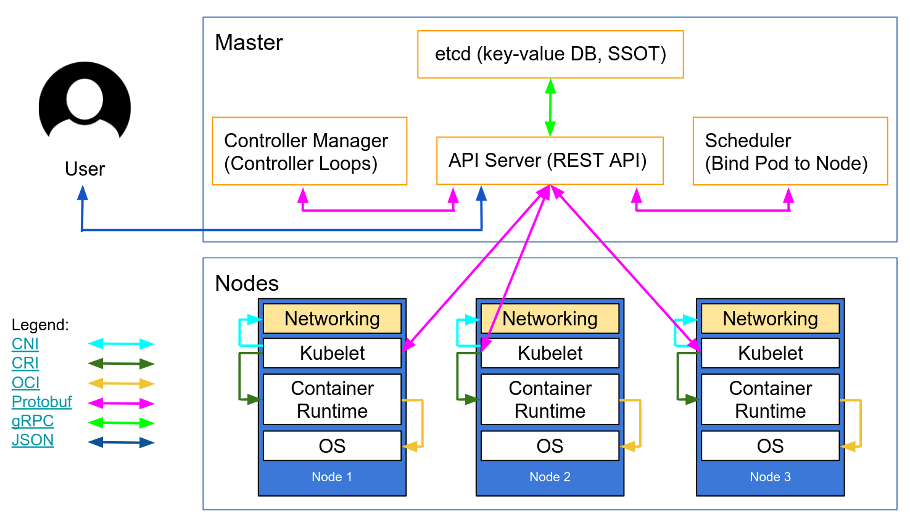

# RIK Enhancement Proposals

  

# Controller

It allows to handle state of cluster by interracting with CLI and scheduler

The controller is the central management entity of the cluster.   
It provides a REST API that can be used to inspect and manipulate the cluster.   
It processes user requests through that API and maintain the cluster overall state.  
The controller keeps track of the cluster tenants, workloads and instances, and make sure current workloads and instances state are as much as possible equal to the desired state.  
After validating user requests, it interacts with the scheduler for orchestrating instances on the cluster via gRPC request.  

  

### External API (with CLI)

REST API

Can receive YAML file for cluster, deployment, pods, configurations the controller has to check that the given rules are compliant and gives instructions to scheduler accordingly.

We may use [Rocket](https://rocket.rs/) as a web server framework.

#### Endpoints :

TBD

  

### Internal API (with scheduler)

Use a gRPC (with protobuf) API has it is best suited for actions that imply mostly to only send commands to others party.

We may use [tonic](https://github.com/hyperium/tonic) to implement gRPC
  

#### Endpoints :

  

TBD

  
  

### Database

The rik system is mostly stateless. The only stateful component of is the etcd database, which acts as the single source of truth for the entire cluster. The API server acts as the gateway to the etcd database through which both internal and external consumers access and manipulate the state.

It stores the configuration, the actual state of the system and the desired state of the system.  
As well as tenant informations like (IDs, quotas, current utilization), workload definition and ownership.  
  
We choose to use ETCD because its seem best for this use case. Distributed database (and used by K8S).  
The controller can also use etcd’s watch functionality to monitor changes between actual vs desired state.
If they diverge, controllers send commands to the scheduler to reconcile the actual state and the desired state.

  
Maybe later we might want to add compatibility with other database like postgres, or SQLite.
So we want to be database agnostic and as @sameo pointed out we need to think about using an light abstraction between our controller and the database for long term use.

### Others

K8S architecture example we might want to follow

[@croumegous](https://github.com/croumegous) & [@MaloPolese](https://github.com/MaloPolese)
