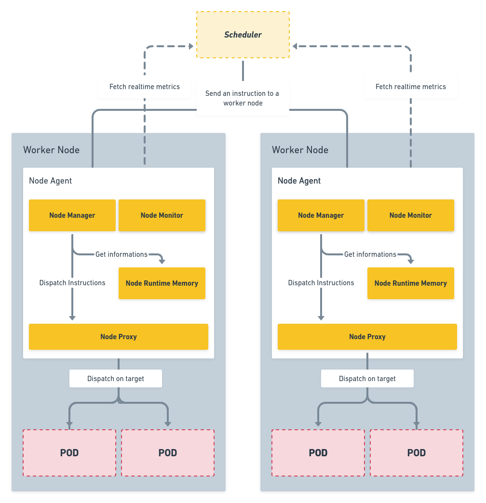

# RIK - Node Agent Architecture

This document provides a technical reflexion about our component, the **node agent**. 
Our component will be installed on each node of a cluster and it will be composed by 4 sub-components :

- **Node Manager**
- **Node Runtime Memory**
- **Node Proxy**
- **Node Monitor**

We will describe these components in more details throughout this document. Below a diagram to illustrate how these components works together.




## Instructions

1. Define requirements:
    which service must the domain provide
        
    what is in scope and out of scope
2. Propose high level architecture 
3. Propose API or commands 
    What Is your component interface
4. (Optional) Send a PR with the above 3 points documented
    agaisnt the “docs/proposals/” folder
    must be approved by the component consumers
    

## Riklet

The rikelet is the primary *node agent* that runs on each node.

### 1) Node Manager

- Interprete Scheduler instructions
- Run an app
- Stop an app
- List apps in the node

### 2) Node Runtime Memory

The Node Runtime Memory is a simple runtime memory which allow us to manage all the running pods on the node.  


Enable to manager pods (bare metal apps or containers).

- Tools to easily read informations about the current avalaible apps on the worker node,
- Runtime memory (save states)

### 3) Node Monitor

The node monitor is responsible to aggregate and return node / pods metrics. It will be useful for the scheduler to different informations about the node. 

For optimization purposes, it will be able to return **node resources**, **realtime node resources** and **realtime pods resources**.

Below an example for each endpoint, of the response returned : 

- Node resources

```json
{
    "id": "node-639d7", // An unique identifier for the node
    "cpu": 12, // Logical CPU cores
    "memory": 34359738368, // Bytes
    "disksize": 536870912000, // Bytes
    "distrib": "Debian",
    "version": 10,
    "type": "linux"
    "arch": "amd64",
    "kernelVersion": "4.19.0-11-amd64",
    "networking": {
        "hostname": "node-639d7",
        "internalip":  "10.114.0.8",
        "externalip":  "134.209.252.162"
    }
}
```

- Realtime node resources

```json
{
    "id": "node-639d7",
    "state": "RUNNING",
    "timestamp": 123456789,
    "cpu": {
        "totalCpu": 12,
        "currentUsage": 20 // Percentage
    },
    "memory": {
        "totalMemory": 34359738368,
        "currentUsage": 50 // Percentage
    },
}
```

- Realtime app resources

```json
{
    "appId": "nginx-56Ksl",
    "state": "RUNNING",
    "createdAt": 123456789, // Timestamp
    "restartCount": 2,
    "internalIp": "10.244.2.177",
    "runsOn": "node-639d7"
    "deployment": {
        "app": "nginx",
        "repository": "https://example.com",
        "version": "1.19.1"
    },
}
```

### 4) Node Proxy

- Packets routing (TCP, UDP, SCTP)
- Redirects entering traffic to the good app
- Should be able to respond

## App

### Actions

- Deploy

    Deployment file example :
    ```yaml    
    name: nginx
    repo: https://example.com/nginx | /usr/share/nginx/html
    version: 1.19.1
    action: deploy
    metadata:
        name: app1
    ```

- List

    ```sh
    $ rik get apps
    ```
    ```
    NAME          STATUS       AGE
    helloworld    Completed    4h12m
    ```
    
- Destroy
    ```sh
    $ rik delete {app_name}
    ```
    ```
    {app_name} deleted on {node_name}
    ```
    