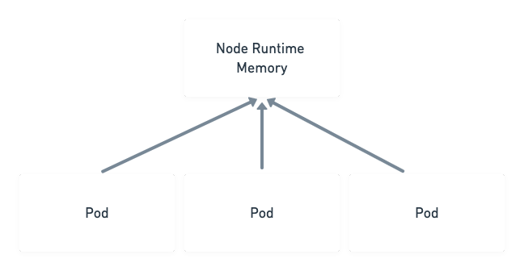
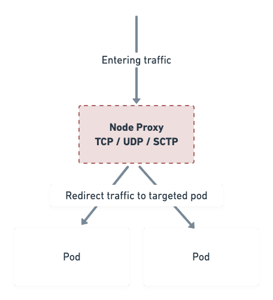

# RIK - Node Agent Architecture (Riklet)

This document provides a technical reflection about our component, the **node agent**.

Our component will be installed on each node of a cluster and it will be composed of 4 sub-components :

- **Node Manager**
- **Node Runtime Memory**
- **Node Proxy**
- **Node Monitor**

We will describe these components in more details throughout this document. Here is a diagram to illustrate how these components works together :


## 1) Node Manager

The Node Manager is the main sub-component of the Riklet. It should be able to :

- Interprete Scheduler instructions
- Run / Stop an application
- List pods in the node

## 2) Node Runtime Memory



The Node Runtime Memory is a simple runtime memory which allow us to manage all the running pods on the node. This component allow the Node Manager to get Pods instance fastly to execute actions on them. It saves the state of each pods.

## 3) Node Monitor

The node monitor is responsible to aggregate and return node / pods metrics. It will be useful for the scheduler to get system resources informations about the node.

For optimization purposes, it will be able to return **node resources**, **realtime node resources** and **realtime pods resources**. Theses informations aim to be used by the Scheduler.

Below returned responses propositions for each endpoint :

- Node resources

```json
{
    "id": "node-639d7", // An unique identifier for the node
    "cpu": 12, // Logical CPU cores
    "memory": 34359738368, // Bytes
    "disksize": 536870912000, // Bytes
    "distrib": "Debian",
    "version": 10,
    "type": "linux",
    "arch": "amd64",
    "kernelVersion": "4.19.0-11-amd64",
    "networking": {
        "hostname": "node-639d7",
        "internalip":  "10.114.0.8",
        "externalip":  "134.209.252.162"
    }
}
```

- Realtime node resources

```json
{
  "id": "node-639d7",
  "state": "RUNNING",
  "timestamp": 123456789,
  "cpu": {
    "totalCpu": 12,
    "currentUsage": 20 // Percentage
  },
  "memory": {
    "totalMemory": 34359738368,
    "currentUsage": 50 // Percentage
  }
}
```

- Realtime app resources

```json
{
    "appId": "nginx-56Ksl",
    "state": "RUNNING",
    "createdAt": 123456789, // Timestamp
    "restartCount": 2,
    "internalIp": "10.244.2.177",
    "runsOn": "node-639d7",
    "deployment": {
        "name": "nginx",
        "repository": "https://example.com/repo",
        "version": "1.19.1"
    },
}
```

## 4) Node Proxy



The Node Proxy should be responsible of the communication between client and applications. It supports TCP, UP et SCTP protocol.
