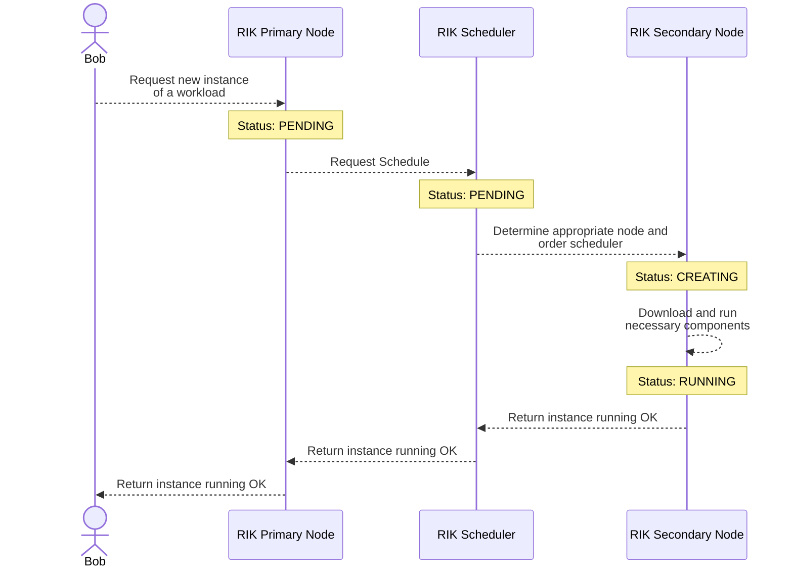

# Workloads

A workload is a definition of a piece of software that should be run on a
cluster. It can be seen as a collection of containers, VM and other resources
that are required to run a software. Defining a workload won't deploy an
instance immediately, but it will be used as a definition to deploy an instance.

The implementation only support JSON format, but the API is designed to be
extensible to support other formats in the future. In case you expect to have a
specific format, please
[open an issue](https://github.com/rik-org/rik/issues/new/choose)
to discuss it.

RIK supports two types of workload:

- **Pod**: A pod is a collection of containers that should be run together. As
  you might imagine in Kubernetes, for each instance, they will be packed
  together and share the same resource limits. They are the most basic
  workload type, and they are used to run a single application.
- **Function**[^1]: A function is a definition for a
  [microVM](https://www.techtarget.com/searchsecurity/definition/micro-VM-micro-virtual-machine)
  that should be running in a more isolated way than a pod. This kind of
  workload supports network capabilities, it means it can be exposed easily on
  the network.

## Lifecycle

Workloads have a common lifecycle which goes through various states. Each time
the state is updated at any step of the lifecycle, the scheduler and the
controller are aware of it and will act accordingly. In the case a failure is
detected, the controller won't try to recover the workload, but it will give the
error message to the user.



## JSON Schema Reference

```json
{{#include schema-v1.json}}
```

[^1]:
    This workload will probably be renamed in the future, as it is not
    strictly related to functions.

<style>
    .mermaid {
        background-color: #fff;
        border-radius: 10px;
    }
</style>
